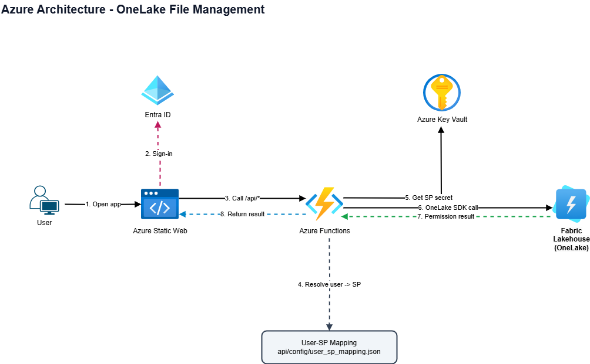
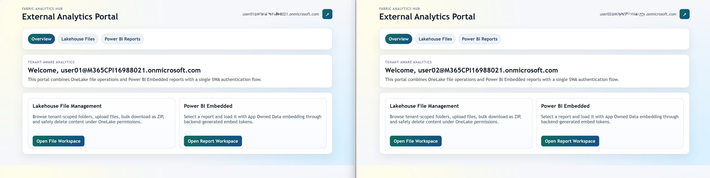
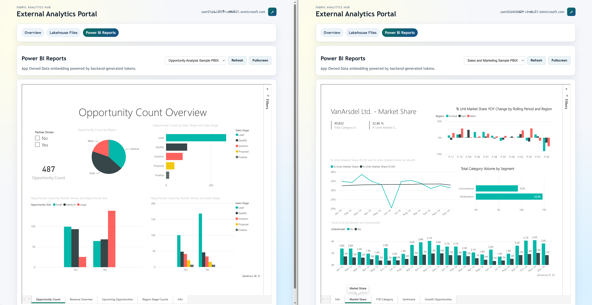

# Fabric Analytics Hub Demo (Azure Static Web Apps + Azure Functions)

## 1. Overview

This project is a demo portal for tenant-aware analytics on Microsoft Fabric, combining OneLake file operations and Power BI Embedded reports.

It uses:

- Microsoft Entra ID for user sign-in
- Azure Static Web Apps for hosting frontend and a linked Azure Functions backend
- React 18.2 + Vite 5.0 + React Router 6.20 for frontend SPA
- User-to-service-principal mapping from Key Vault (with local file fallback)
- Azure Key Vault for service principal secret details
- OneLake file operations through the official OneLake-supported Python SDK pattern (`azure-storage-file-datalake` + Entra auth)
- Power BI App Owned Data embedding through backend-generated embed tokens

After sign-in, the app maps the user to a specific service principal, then uses that principal for both OneLake and Power BI access boundaries.

## 2. Implemented Features

- Entra ID sign-in / sign-out
- User-to-service-principal mapping from Key Vault secret or local config file (UPN -> SP secret name)
- Service principal details loaded from Azure Key Vault
- Folder-level access control enforced by Fabric OneLake permissions (not code)
- File list in folder: name, modified time, type, size
- Multi-file upload with visible upload progress
- Multi-select download as ZIP
- Embedded Power BI reports using App Owned Data
- OneLake SDK enforces permissions: if user's SP lacks access to a folder, OneLake returns permission error

## 3. High-Level Architecture

- Frontend: `frontend/` (React + Vite)
- Backend API: `api/` (Python Azure Functions, deployed separately and linked to SWA)
- Mapping source: Key Vault secret `USER_SP_MAPPING_SECRET_NAME` (fallback: `api/config/user_sp_mapping.json`)
- Secrets source: Azure Key Vault secrets (JSON payload)

## 4. Logical Flow Diagram

This architecture reflects the current implementation and Azure service chain:

`User -> Azure Static Web Apps -> Linked Azure Functions -> Azure Key Vault -> OneLake + Power BI`

Rendered diagram (PNG):



Editable source (draw.io):

- `architecture-azure-minimal.drawio`

Open the draw.io file in VS Code with the Draw.io extension to edit the architecture diagram.

**Key Flow:**
1. User accesses the frontend hosted on Azure Static Web Apps.
2. User authentication is handled through Microsoft Entra ID.
3. Frontend calls the `/api` route on Azure Static Web Apps.
4. Function app reads user-to-service-principal mapping from Key Vault secret (or local config fallback).
5. Function app fetches service principal credentials from Azure Key Vault.
6. Function app calls Fabric Lakehouse (OneLake) via SDK using mapped SP credentials.
7. Function app also uses mapped SP credentials to call Power BI REST APIs and generate embed tokens.
8. OneLake and Power BI enforce data/report access boundaries.
9. Function app returns the result to frontend for display.

## 5. User Mapping Configuration

Primary source: Key Vault secret name set in `USER_SP_MAPPING_SECRET_NAME`.

Fallback source: local file `api/config/user_sp_mapping.json`.

If both are configured, the app uses Key Vault first and falls back to file only when Key Vault mapping cannot be loaded.

Optional behavior control:

- `USER_SP_MAPPING_ALLOW_FILE_FALLBACK=true|false` (default: `true`)

File: `api/config/user_sp_mapping.json`

This file maps Entra ID user UPN to a Key Vault secret name that contains the service principal credentials. The mapping is simple and does not include folder or permission information.

```json
{
  "users": {
    "user01@contoso.com": "sp-user01-onelake",
    "user02@contoso.com": "sp-user02-onelake"
  }
}
```

**Important:** Actual folder-level permissions are managed through Fabric OneLake UI, not this config file. See section 7 below.

## 6. Folder-Level Permission Configuration in Fabric

All folder-level access control is enforced by Fabric OneLake, not by the application code. This is the recommended security approach.

### Steps:

1. In Fabric workspace, open your lakehouse.
2. Navigate to the **Files** section.
3. For each folder (e.g., `customer01`, `customer02`, ...):
   - Right-click the folder → **Manage access**
   - Add each service principal with desired permission:
     - **Read**: Can list files and download
     - **Write**: Can list, download, upload, delete files
4. The application will enforce these permissions at the OneLake SDK level.

### Security Notes:

- The app code does not validate or restrict folder access; it relies entirely on OneLake permissions.
- If a service principal lacks permission to a folder, the OneLake SDK will raise an error.
- Always configure permissions in Fabric UI for clear auditing and compliance.

## 7. Key Vault Secret JSON Schema

Each `service_principal_secret_name` points to one Key Vault secret. The secret value must be JSON:

```json
{
  "tenant_id": "<tenant-guid>",
  "client_id": "<service-principal-client-id>",
  "client_secret": "<service-principal-client-secret>",
  "onelake_account_name": "onelake",
  "workspace_name": "<fabric-workspace-name>",
  "lakehouse_name": "<fabric-lakehouse-name>",
  "root_path": "<lakehouse>.Lakehouse/Files",
  "powerbi_workspace_id": "<powerbi-workspace-id>",
  "powerbi_report_ids": [
    "<report-guid-1>",
    "<report-guid-2>"
  ]
}
```

Notes:

- `root_path` is optional. If omitted, default is `<lakehouse_name>.Lakehouse/Files`.
- `powerbi_workspace_id` is required for Power BI report APIs.
- `powerbi_report_ids` is optional. If omitted or empty, all workspace reports are returned.
- The API enforces that user can only access the mapped folder.

## 8. Portal Screenshots

This section showcases the runtime appearance of the Fabric Analytics Hub portal.

### Overview Page

The landing page displays available features and navigation to file management and Power BI reports.



### Lakehouse Files

Users can browse, upload, download, and delete files within authorized folders. Folder-level permissions are enforced at the OneLake SDK level.


### Power BI Reports

Embedded Power BI reports render with App Owned Data embedding powered by backend-generated tokens. Reports display in responsive containers with refresh and fullscreen controls.



## 9. API Endpoints

- `GET /api/profile` - Returns authenticated user info
- `GET /api/folders` - Returns list of available folders for user to try accessing
- `GET /api/files?folder=<folderName>` - Lists files in the specified folder (OneLake enforces SP permissions)
- `POST /api/upload?folder=<folderName>` (multipart form field name: `files`) - Uploads files (OneLake enforces SP write permission)
- `POST /api/download?folder=<folderName>` (JSON body: `{ "files": ["a.txt", "b.csv"] }`) - Downloads files as ZIP (OneLake enforces SP read permission)
- `POST /api/delete?folder=<folderName>` (JSON body: `{ "files": ["a.txt", "b.csv"] }`) - Deletes selected files (OneLake enforces SP write permission)
- `GET /api/reports` - Returns available Power BI reports for the mapped SP
- `POST /api/reports/embed` (JSON body: `{ "reportId": "<guid>" }`) - Generates App Owned Data embed config

## 10. Local Development

Use the dedicated hands-on guides:

- `HANDS_ON.md` (Part 1: File Management foundation)
- `HANDS_ON_REPORT.md` (Part 2: Report module)

Quick start (React frontend):

1. Prepare API settings:
  - Copy `api/local.settings.sample.json` to `api/local.settings.json`.
  - Fill `KEY_VAULT_URL` and optional local-dev auth values.
2. Install dependencies:

```bash
cd frontend
npm install
cd ..\api
python -m venv .venv
.venv\Scripts\activate
pip install -r requirements.txt
```

3. Start API (terminal 1):

```bash
cd api
func start
```

4. Start Vite dev server (terminal 2):

```bash
cd frontend
npm run dev
```

5. Start SWA local proxy (terminal 3):

```bash
swa start http://localhost:5173 --api-location api --app-location frontend
```

6. Open `http://localhost:4280` in browser and test sign-in, folder operations, and Power BI report embedding.

## 11. Security Notes

- Never store service principal secrets in source code.
- Use Key Vault access control and least privilege.
- Restrict Key Vault access to the app's managed identity in cloud.
- Always configure folder permissions in Fabric OneLake UI for clear governance and compliance.

## 12. Deployment Model

Production uses a linked API model:

1. Deploy the frontend to Azure Static Web Apps.
2. Deploy the backend to a separate Azure Functions app.
3. Link the Functions app in the Static Web Apps portal under **APIs**.
4. Keep `/api/*` requests in the frontend; SWA proxies them to the linked backend.

For Azure DevOps / Azure Repos, the recommended flow is:

1. Push this repository to Azure Repos.
2. Create an Azure DevOps service connection for the Azure subscription that hosts the Function App and Static Web App.
3. Store `AZURE_SERVICE_CONNECTION`, `FUNCTION_APP_NAME`, and `AZURE_STATIC_WEB_APPS_API_TOKEN` as secret pipeline variables or in a variable group.
4. Use [azure-pipelines.yml](azure-pipelines.yml) as the main deployment pipeline.
5. Let the pipeline deploy the Function App first, then build and deploy the Static Web App.
6. The Function App pipeline now uses local package creation plus zipDeploy, which avoids Kudu storage key checks in accounts that disallow shared key authentication.

Important notes:

- The linked Functions app must remain publicly reachable by SWA.
- Set `api_location` to an empty string in the SWA workflow when using BYO Functions.
- PR preview environments do not support linked backend APIs.

## 13. Deployment Assets

- Main Azure DevOps pipeline: [azure-pipelines.yml](azure-pipelines.yml)
- End-to-end release checklist: `DEPLOYMENT_CHECKLIST.md`
- Key Vault service principal profile template: `api/config/service_principal_secret.sample.json`
